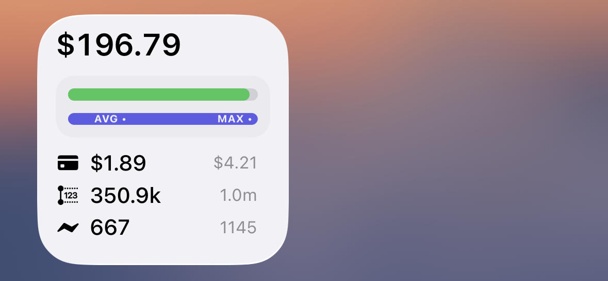
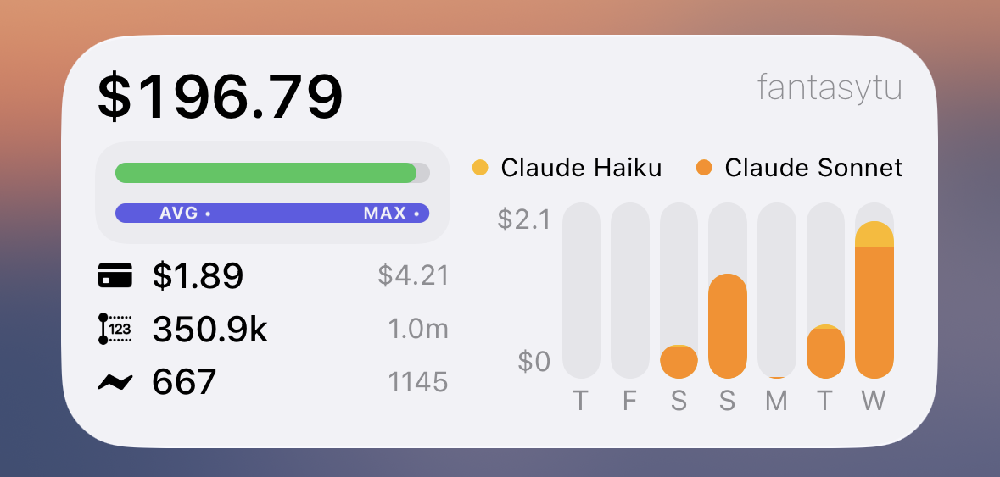
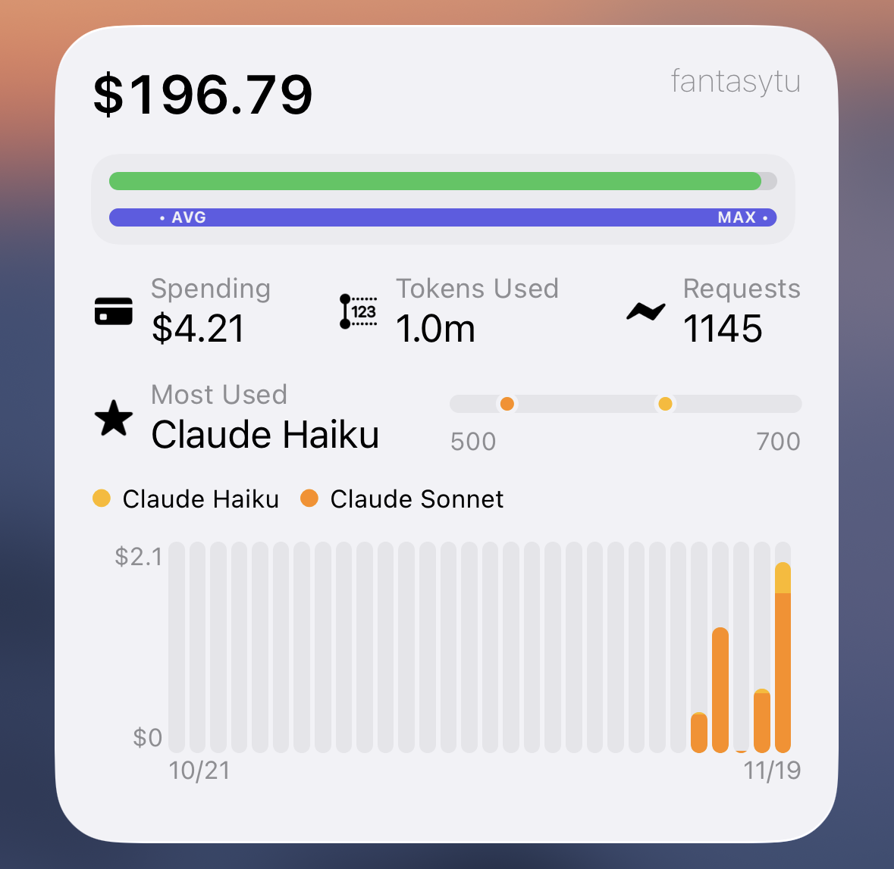

# Packy Usage Widget

[English](./README.md) | [中文](./README.zh-CN.md)

A powerful Scriptable widget for iOS that displays your API usage statistics in real-time. Monitor your balance, spending, and model usage directly from your home screen.

**Author:** Fantasy
**Date:** 2025-11-19

---

## Features

### 📊 Real-Time Usage Tracking
- Display your current account balance and remaining quota
- Track daily, weekly, and monthly API usage
- Monitor request counts and token consumption
- View spending statistics for each period

### 🎨 Three Widget Sizes
The widget supports multiple sizes to fit your home screen layout:

#### Small Widget

*Compact view showing balance, usage progress, and key metrics*

#### Medium Widget

*Balanced layout with usage bars and model distribution chart*

#### Large Widget

*Full-featured view with detailed statistics and 30-day chart*

### 🌗 Dark & Light Mode Support

*Automatically adapts to your system appearance settings*

### 📈 Advanced Visualizations
- **Progress Bars**: Visual representation of remaining balance and daily usage
- **Usage Indicators**: AVG and MAX labels showing average and maximum usage
- **Model Distribution**: Bar charts showing which AI models are being used most
- **Range Indicators**: Visual range display of model usage patterns

### 🤖 Multi-Model Support
Track usage across multiple AI models including:
- OpenAI (GPT-5, GPT-5.1)
- Anthropic (Claude Haiku, Sonnet, Opus)
- Google (Gemini Flash, Pro)
- And more...

---

## Installation

1. **Open Scriptable App** on your iOS device
2. **Create a New Script** and copy the entire content of `Packy Usage.js`
3. **Configure Your Credentials**:
   - Obtain your `USER_ID` and `SESSION` from the Packy API
   - Update the `CONFIG` object:
     ```javascript
     const CONFIG = {
       API_BASE_URL: "https://www.packyapi.com",
       USER_ID: "your_user_id",
       SESSION: "your_session_token",
       UNIT: 500000,
       DAYS_TO_FETCH: 30,
     };
     ```
4. **Add to Home Screen**:
   - Long press on your home screen
   - Tap "+" to add a widget
   - Search for "Scriptable"
   - Choose your desired size (Small, Medium, or Large)
   - Select the script you created
   - Tap "Add Widget"

---

## Widget Sizes Explained

### Small Widget
**Best for:** Quick glance at your balance
**Shows:**
- Current balance
- Remaining quota vs used quota
- Today's spending
- This week's tokens used
- Current request count

### Medium Widget
**Best for:** Balanced information display
**Shows:**
- Left side: Balance, usage metrics, and info
- Right side: User name, model legend, weekly chart
- Compact but comprehensive view

### Large Widget
**Best for:** In-depth analytics
**Shows:**
- Top section: Balance and user info
- Middle: Total spending, tokens, and requests
- Most used model with range indicator
- Bottom: Model breakdown and 30-day chart

---

## Usage Indicators

### Progress Bars
The widget displays two progress bars:

1. **Remaining Bar** (Top)
   - Shows your available balance vs used amount
   - Color indicates health status:
     - 🟢 Green: Healthy (>20% remaining)
     - 🟡 Yellow: Warning (10-20% remaining)
     - 🔴 Red: Critical (<10% remaining)

2. **Usage Bar** (Bottom)
   - Shows today's usage compared to maximum
   - **• AVG**: Average daily usage marker
   - **MAX •**: Maximum usage reached marker
   - Labels hide if there's insufficient space

---

## Data Refresh

The widget fetches fresh data each time you interact with it. Data includes:
- Last 30 days of API usage
- Daily breakdown by model
- Total usage statistics
- Current balance information

---

## Technical Details

### Architecture
- **ColorManager**: Handles all color theming and model-specific colors
- **DataFetcher**: Retrieves API data from Packy servers
- **DataProcessor**: Processes raw data into usable statistics
- **ChartRenderer**: Creates charts and visualizations
- **UIComponents**: Builds widget UI elements
- **BaseWidget**: Foundation for all widget sizes
- **WidgetFactory**: Creates appropriate widget based on size

### Key Technologies
- **DrawContext**: For precise pixel-level graphics rendering
- **ListWidget**: Scriptable's layout system
- **Dynamic Colors**: Automatic dark/light mode support

---

## Customization

You can customize various aspects of the widget:

```javascript
const UI_CONSTANTS = {
  WIDGET_CORNER_RADIUS: 12,      // Border radius
  GAUGE_SPACING: 12,              // Space between elements
  THRESHOLDS: { GOOD: 20, WARNING: 10 },  // Alert thresholds
};
```

---

## Troubleshooting

### Widget shows error
- Verify your `USER_ID` and `SESSION` are correct
- Check your internet connection
- Ensure you're using the latest version of Scriptable

### Data not updating
- Refresh the widget by tapping it
- Check that the API is responding
- Review your credentials in CONFIG

### Labels overlap or disappear
- This is intentional - labels hide when space is insufficient
- Ensure your widget size is appropriate for your screen

---

## Color Scheme

| Element | Light Mode | Dark Mode |
|---------|-----------|-----------|
| Text | #000000 | #FFFFFF |
| Secondary | #8E8E93 | #636366 |
| Background | #F2F2F7 | #1C1C1E |
| Progress Bar | #5E5CE6 | #5E5CE6 |

---

## License

This widget is created for personal use. Feel free to modify and adapt it to your needs.

---

## Support

For issues or questions:
1. Check the Packy API documentation
2. Verify your credentials are correct
3. Ensure Scriptable has necessary permissions
4. Review the console logs in Scriptable for errors

---

**Happy tracking! 📊**
